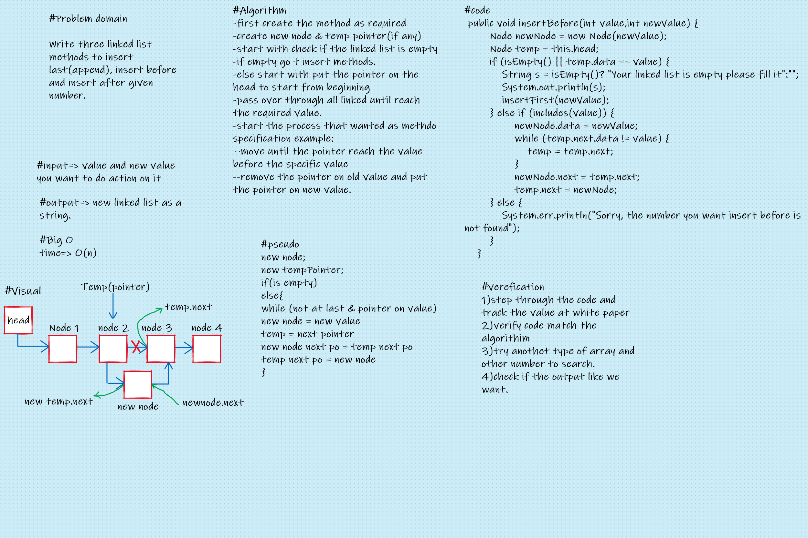

# Singly Linked List
### Type of data structure allow us to store a collection of data not next to each other, and we can link the data with each other by pointer that point on the location of next data.

## Challenge
### Create a new data structure type(Linked list) containing three methods in LinkedList class and declare its properties , also this method to implementation append, insert before and insert after process.

## Whiteboard Process

## Approach & Efficiency
### The approach I followed it is, first I tried to understand the problem right stand because the generation of the method of this type in data structure depends on problem domain, then I start to writing algorithm I will followed it , and al whiteboard other process as showed in picture below then I start to solve that's method by method.
### The Big O for this Challenge is different from method to other, I will mention that in section below.

## API
### 1) Append:This method created to insert number at last of linked list, In this method the Big O type is Linear O(n) because the method scan its input.

### 2) Insert before : this method take two number first the number you want to add the new number before it and the new number itself. this method take also linear B(n) type because scan its input.

### 3) Insert before : this method take two number first the number you want to add the new number after it and the new number itself. this method take also linear B(n) type because scan its input.
