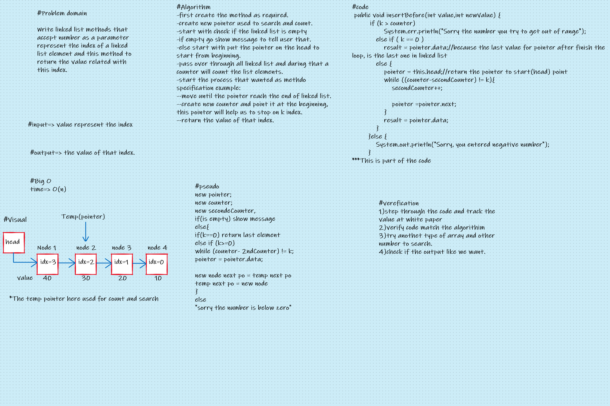

# Challenge Summary

### Write method for the Linked List class (kth from end) accept a parameter(int k) and Return the node’s value that is k places from the tail of the linked list.

## Whiteboard Process

## Approach & Efficiency

### The approach I followed it is, first I tried to understand the problem right stand because the generation of the method of this type in data structure depends on problem domain, then I start to writing algorithm I will follow it , and al whiteboard other process as showed in picture below then I start to solve that's line by line.
### The Big O for this Challenge is different from method to other, I will mention that in section below.

## API

### 4) linked list kth: This methode take one parameter represent the index and return the value of that index. this method take also linear B(n) type because scan its input*.

#### *This method from challenge 07.