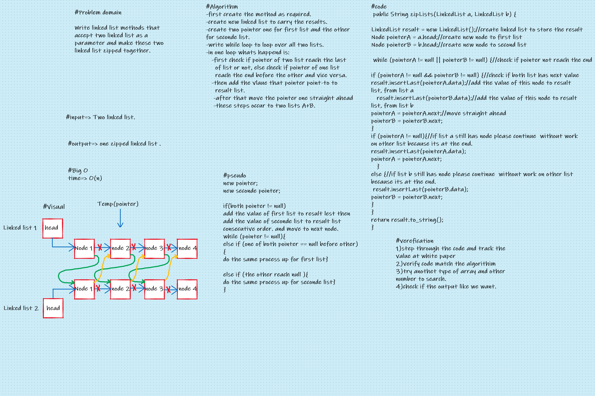

# Challenge Summary

### Write linked list methods that accept two linked list as a parameter and make these two linked list zipped together.

## Whiteboard Process

## Approach & Efficiency
### The approach I followed it is, first I tried to understand the problem right stand because the generation of the method of this type in data structure depends on problem domain, then I start to writing algorithm I will followed it , and al whiteboard other process as showed in picture below then I start to solve that's method by method.
###  In this method the Big O type is Linear O(n) because the method scan its input and has one while loop.
 

## Solution
<!-- Show how to run your code, and examples of it in action -->
### You can run and test my code by follow this path:
### data-structures-and-algorithms/Challenge05